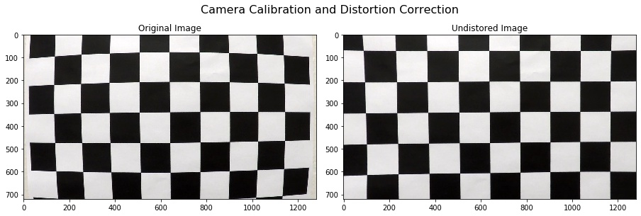
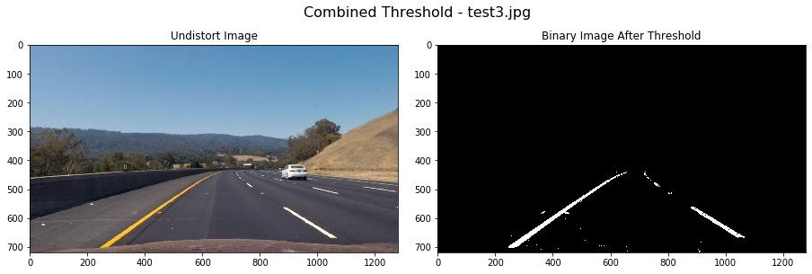
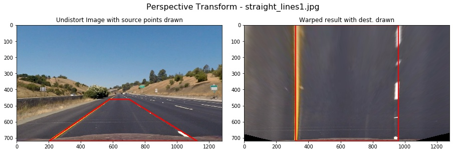
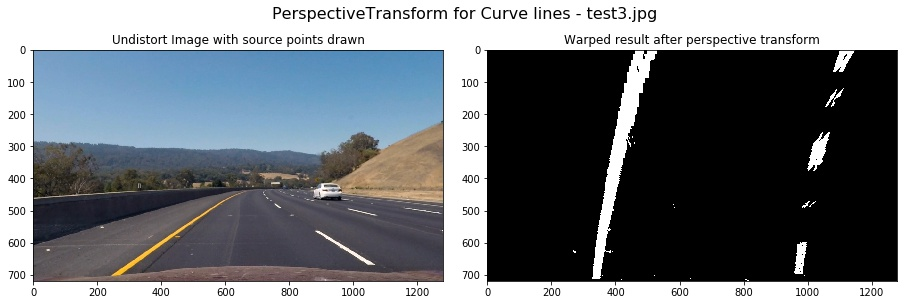
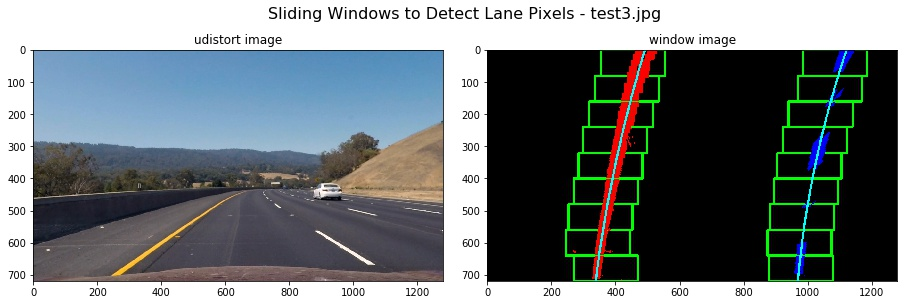
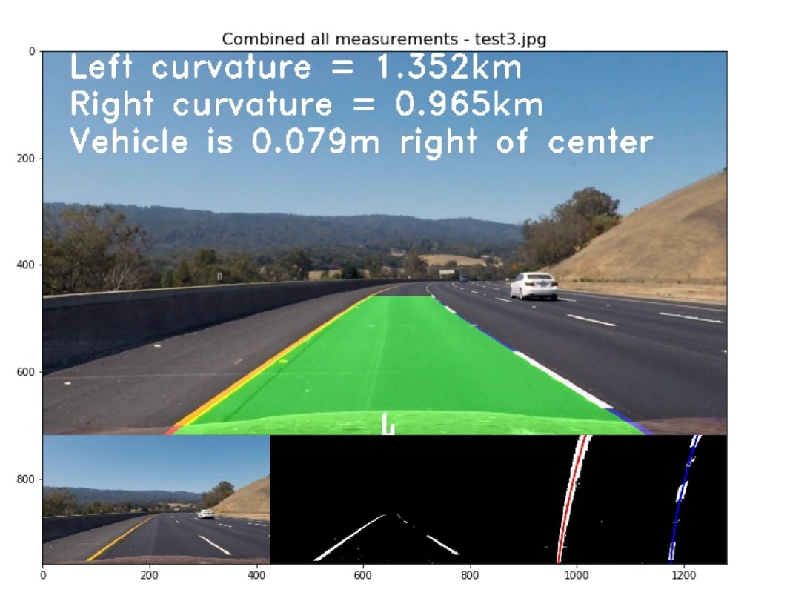

## Advanced Lane Finding

[](http://www.udacity.com/drive)

The goals / steps of this project are the following:

- Compute the camera calibration matrix and distortion coefficients given a set of chessboard images.
- Apply a distortion correction to raw images.
- Use color transforms, gradients, etc., to create a thresholded binary image.
- Apply a perspective transform to rectify binary image ("birds-eye view").
- Detect lane pixels and fit to find the lane boundary.
- Determine the curvature of the lane and vehicle position with respect to center.
- Warp the detected lane boundaries back onto the original image.
- Output visual display of the lane boundaries and numerical estimation of lane curvature and vehicle position.

## Camera Calibration

I start by preparing "object points", which will be the (x, y, z) coordinates of the chessboard corners in the world. Here I am assuming the chessboard is fixed on the (x, y) plane at z=0, such that the object points are the same for each calibration image.  Thus, `objp` is just a replicated array of coordinates, and `objpoints` will be appended with a copy of it every time I successfully detect all chessboard corners in a test image.  `imgpoints` will be appended with the (x, y) pixel position of each of the corners in the image plane with each successful chessboard detection.  

I then used the output `objpoints` and `imgpoints` to compute the camera calibration and distortion coefficients using the `cv2.calibrateCamera()` function.  I applied this distortion correction to the test image using the `cv2.undistort()` function and obtained this result: 



## My Pipeline

In my codes file `P2-Advanced-Lane-Finding.ipynb`,  I set up four classes, which are `class CameraCalibrator()` , `class BinaryThresholder()`, `class PerspectiveTransfromer()` and `class Line()`. 

#### 1. Undistort test images

 `class CameraCalibrator()`

I made use of the results  from `Camera Calibration`  to undistort the test3.jpg.  My calibration can correct the edge's distortion of the image. The results as follows:


#### 2. Color and Gradient threshold to make binary image

`class BinaryThresholder()`

In this part,  I used color and gradient threshold to the image and applied a mask to extract the lane lines. I did a lot of job on various color thresholds that can be applied to find the lane lines in images. At last, I made a decision that v channel of `HSV`  and s channel of  `HLS`  were sensitive to yellow color shadow pixels.  In order to find more yellow color, I use `cv2.inRange(hsv, (26, 43, 46), (34, 255, 255))` in `HSV Color Space`. 

After applying a color thresh, I explored the  `Sobel` gradient to compute the  derivative in the x direction which can detect the  approximate vertical edges. And then, I used a mask to select the interest area.  The steps combining all of these are in `class BinaryThresholder()`.

```python
# Apply color thresh
color_binary = color_tresh(img, s_thresh = (120, 255), v_thresh = (50, 255))
# Sobel_x thresh
gradx = abs_sobel_tresh(img, orient = 'x', thresh = (20, 255)) 
grady = abs_sobel_tresh(img, orient = 'y', thresh = (25, 255))
# extract yellow
ylw = extract_yellow(img)
# combined thresholdy
combined_binary = np.zeros_like(color_binary)
combined_binary[((gradx == 1) & (grady == 1)) | (color_binary == 1) | (ylw == 255)] = 1
# Apply a mask to select intresting
binary = region_of_interest(combined_binary)
```

Using these methods above, I got an good result on test3.jpg:



#### 3. Perspective Transform

`class PerspectiveTransfromer()`

The codes for my perspective transform includes a class called `class PerspectiveTransfromer()`, which appears in part 3. The `warper()` function takes as inputs an image (`img`), as well as source (`src`) and destination (`dst`) points.  I chose manually  the source and destination points in the following manner:

```python
# source points
self.src = np.float32(
    [[(img_size[1] / 2) - 60, img_size[0] / 2 + 100],
    [((img_size[1] / 6) - 10), img_size[0]],
    [(img_size[1] * 5 / 6) + 60, img_size[0]],
    [(img_size[1] / 2 + 60), img_size[0] / 2 + 100]])

#destination points
self.dst = np.float32(
    [[(img_size[1] / 4), 0],
    [(img_size[1] / 4), img_size[0]],
    [(img_size[1] * 3 / 4), img_size[0]],
    [(img_size[1] * 3 / 4), 0]])
```

This resulted in the following source and destination points:

|  Source   | Destination |
| :-------: | :---------: |
| 580, 460  |   320, 0    |
| 203, 720  |  320, 720   |
| 1127, 720 |  960, 720   |
| 700, 460  |   960, 0    |

First, I verified my transform on straight line. We can see that the transformed lines were approximately vertical:



And then, I used the same `src ` and `dst` points to the curve lines. The result image verified that the lines seemed to be parallel in the warped image and my transform were correct.



#### 4. Detect lane pixels and find the lane boundary and compute the boundary.

`class Line()`

#### 4.1 Detect lane pixels and fit a polynomial

I detected lane pixels using the sliding windows in Part 4 in my `P2-Advanced-Lane-Finding.ipynb`. The codes appears in the function `find_lane_pixels` of `lines 198-271`. And then in function `fit_polynomial`of `lines 276-305`, I used the detected lane pixels to compute the lane boundary. I located the lane line pixels, and then used their x and y pixel positions to fit a second order polynomial curve: **f(y) = Ax<sup>2</sup> + Bx + C**



After I fit a second polynomial on the first frame, then for next frame, each y position, I have an x position that represents the lane center from the last frame. I search for the new line within +/- some margin around the old line center. The function `search_from_prior()` in `lines 307-333`  of Part 4 implemented this. The function `Class Line().find_best_fitx()` combined all of these to initialize the member variable `self.recent_xfitted` so that I smoothed the current measurements using previous 5 frames. I used the member variable `n_frame` of `class Line()` to control whether the pipeline used the sliding window to detect pixels `(self.n_frame=1)` or searched around from last frame `(self.n_frame>1)`.  The member variable `self.recent_xfitted`  must be initialized only once in all frames, So the `self.recent_xfitted` appended every frame's results to smooth the current result.

#### 4.2 Compute curvature

I computed the lane curvature in member function `getCurvature()` of `class Line()` in lines `161-197`. In 4.1 part, I located the lane line pixels, used their x and y pixel positions to fit a second order polynomial curve: **f(y) = Ax<sup>2</sup> + Bx + C**.

The radius of curvature ([awesome tutorial here](http://www.intmath.com/applications-differentiation/8-radius-curvature.php)) at any point *x* of the function *x*=*f*(*y*) is given as follows:


In the case of the second order polynomial above, the first and second derivatives are:


So, our equation for radius of curvature becomes:


In my codes, I got the `left_fit_cr` and `right_fit_cr` of `polynomial coefficients` . so if, I wanted to measure the radius of curvature closest to the vehicle, I could evaluate the formula above at the *y* value corresponding to the bottom of your image, or in Python, at `y_eval = image.shape[0]` in the codes as follows. 

```python
# Calculation of R_curve (radius of curvature)
left_curvature = (1 + (2*left_fit_cr[0]*y_eval + left_fit_cr[1])**2)**1.5 / np.abs(2*left_fit_cr[0]) 
right_curvature = (1 + (2*right_fit_cr[0]*y_eval + right_fit_cr[1])**2)**1.5 / np.abs(2*right_fit_cr[0]) 
```

#### 4.3 Back to road image

I've calculated the radius of curvature based on pixel values, so the radius we are reporting is in pixel space. So I actually needed to repeat this calculation after converting our x and y values to real world space.  In the member function `class Line().inversed_warp()`  in `lines 108-164`,  I  implemented project the warped image back to the road with the lane boundary and curvature and vehicle position as follows:



In the pipeline in part 5 and part 6 of `P2-Advanced-Lane-Finding.ipynb`, all the classes were instantiated outside the pipeline. This must be pay much attention.

## My video

Here's a [link to my video result](./project_video_output.mp4)

## Discussion

#### 1. Sanity Check

In my project, I didn't make use of `Sanity Check` to check whether the two lines are parallel or their curvature were similar.  I know that if polynomial coefficients have approximate values,  they may be parallel. But I don't know how much difference between two lines' coefficients  that may determine they are parallel or similar. Technically, Only in this case that two lines have the same coefficients,  We can say they are strictly parallel. So, I adjust the parameters again and again so that the results seems like to be feasible.

#### 2. Smoothing

The member variable `self.smooth_facotor` in `class Line()` was used to smooth over the last `self.smooth_facotor` frames to obtain a cleaner result.  I found when the value war bigger than 15, the results appeared to be worse and worse. It may be that the average accumulates the error of past frames.

#### 3. Attention for pipeline

The four classes should pay much attention to their constructed function `__init__(self)`, because when I built the pipe line, I found they should be initialize outside of the pipeline.  Calibration and perspective transformer should be compute only once for all frames in a video. The member variables of `class Line()`  should be initialized only once too, because I used the previous measurements to smooth the current results. So I paid much attention to building the four classes.

#### 4. Problems of My Pipeline

I tried my pipeline on challenge video, and found that the results were bad. First off, various gradient and color thresholds only work in a small set of conditions. Secondly, When I applied a perspective transform, choosing four source points manually, as we did in the lecture, is often not the best option. This caused the transform in my pipeline can only use in specific situations like those in my project. Lastly, my pipeline was slow,  only ran at roughly 3.4 frames per second (fps), while video from a car would likely be coming in around 30 fps or more. So in the future, I will have a try on deep learning to improve my pipeline, and I believe that will be better performance.
